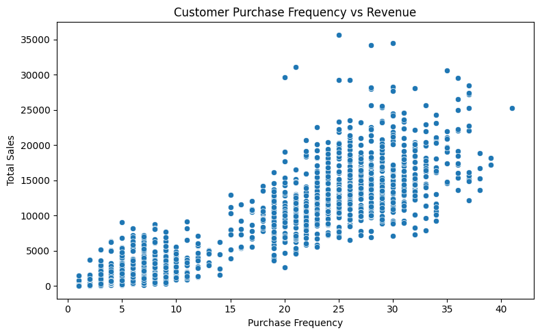

# 🛒 Global Superstore Data Analysis

This project performs in-depth customer and product-level analysis on the Global Superstore dataset. It aims to generate actionable business insights through exploratory data analysis and visualization using Python.

---

## 📂 Dataset

The dataset contains worldwide sales transactions from a superstore, including:
- Customer details (Segment, Region, ID)
- Product info (Category, Sub-Category, Sales, Discount, Profit)
- Shipping and order dates
- Country-wise sales and delivery data

---

## 🔍 Analysis Covered

### 📊 Customer Analysis
- Purchase frequency per customer
- Revenue contribution by frequent buyers
- Profit margin comparison across frequency tiers
- Most profitable customer segment per year
- Customer distribution across countries

### 📦 Product Analysis
- Top sales-generating countries
- Top 5 most profitable product sub-categories by year
- Relationship between price and sales at a daily level
- Average delivery time per country

---

## 🧰 Tech Stack

- **Python**
- **Pandas**, **Seaborn**, **Matplotlib**, **Plotly**
- **Jupyter Notebook**

---

## 📸 Sample Visualizations

### Customer Purchase Frequency vs Revenue


### Daily Average Price vs Sales


### Top 5 Profit-Making Sub-Categories per Year


---

## 🚀 Getting Started

1. Clone this repo:
   ```bash
   git clone https://github.com/your-username/global-superstore-analysis.git

2. Install dependencies:
    ```bash
    pip install pandas matplotlib seaborn plotly

3. Run the Jupyter Notebook:
    ```bash
    jupyter notebook GlobalSuperstore_Analysis.ipynb

## 💡 Insights

1. Frequent customers do not always translate into higher profit margins.

2. Phones and Copiers are consistently the most profitable sub-categories.

3. Lower average prices often correlate with higher sales volume.